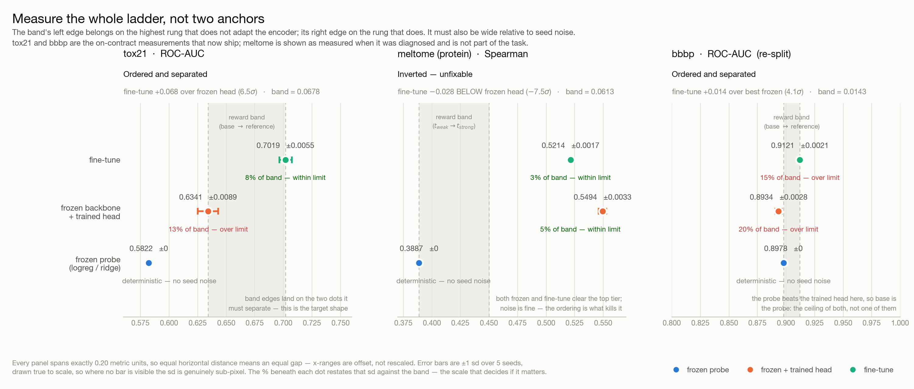

# Harbor ML-engineering RL environments

Agent-evaluation environments for ML engineering: give an agent a pretrained model, a
fixed compute budget and labelled data, and score whether it can *adapt* the model —
not whether it can call `fit()`.

The hard part is not the task. It is the **reward**: making a number that goes up only
when the agent does the work you meant to test, and that says the same thing twice in a
row. Most of this repo is the evidence for two anchors per eval set.

---

## The two tasks

| | [`tasks/mol-property-adapt`](tasks/mol-property-adapt/) | [`sciml-protein-regression`](sciml-protein-regression/) |
|---|---|---|
| **status** | **active — ships** | **shelved — measures nothing** |
| base model | ChemBERTa-77M-MLM (3.4M params) | ESM-2-8M |
| data | Tox21 + BBBP, chemical-region holdouts | FLIP2 meltome-mixed |
| metric | mean ROC-AUC | Spearman |
| compute | **no GPU** — 8 CPUs, 16 GB, 4 h | **1 GPU** + 4 CPUs, 24 GB, 4 h |
| reward | continuous recovery between two *measured* anchors | 3 discrete tiers on *fixed* thresholds |
| why | ordered ladder, 6.5σ and 4.1σ separation | **inverted**: a frozen probe beats a fine-tune |

The protein task is kept because its verifier is the better-hardened of the two and
because the negative result is worth reading. Its reward is not usable — see
[Why the protein task is shelved](#why-the-protein-task-is-shelved).

---

## Two reward schemes

The two tasks score in genuinely different ways. They were designed independently, and
comparing them is most of what this repo learned.

### `mol-property-adapt` — continuous, between measured anchors

```
recovery = clip((auc − base) / (reference − base), 0, 1)
reward   = integrity_gate × mean(recovery over eval sets)
```

Both anchors are **measurements**, taken over 5 seeds on the private split, each
re-derivable from a committed script. Integrity is a separate multiplicative gate, so a
0 always carries an attributable reason instead of being indistinguishable from a weak
model. The uncapped `recovery_raw` is recorded alongside the capped value.

### `sciml-protein-regression` — three tiers, on fixed thresholds

```
reward = 0.0   if integrity fails, or spearman < t_weak          (0.3887)
       = 0.5   if t_weak ≤ spearman < t_strong                   (0.45)
       = 1.0   if spearman ≥ t_strong
       = 0.0   if spearman ≥ t_implausible (0.75) — flagged, not scored
```

No `base`/`reference` pair, no recovery, no reference-training script. `t_weak` was
calibrated (a frozen mean-pool Ridge probe); `t_strong` was **chosen** — its own note
says "a fixed strong-oracle bar below the successful Codex run (~0.57)". Nothing
produces it.

### Why the tiered scheme lost

Not taste — four concrete failures, all visible in this repo:

1. **Quantization makes every calibration error maximal.** A submission 0.001 past
   `t_strong` scores identically to one 0.1 past. With three levels, a mis-set threshold
   costs the *entire* distinction rather than a proportional slice. Continuous recovery
   degrades gracefully; tiers do not degrade at all.
2. **Both thresholds are mis-set, and the file proves it.**
   `scripts/probe_ceiling.json` records `tiers_json_claims_frozen_probe: 0.3887` beside a
   mean-pool Ridge at **0.4586**, a nonlinear head at **0.4973**, and a trained head at
   **0.546** — three frozen methods, none of which adapts the encoder, and two of which
   clear `t_strong = 0.45` outright.
3. **The upper anchor is unreproducible by construction.** `t_strong` is a round number
   under an observed result; no script emits it. The mol task's `reference_auc` is
   defined by a shipped solution — imperfectly, see Open questions, but the invariant at
   least *exists* and can be checked.
4. **Thresholds amplify noise instead of absorbing it.** A submission near a boundary
   flips tiers between reruns, changing the reward by 0.5. Under recovery the same
   wobble moves the score proportionally, and `band_sigma` makes the noise-to-signal
   ratio an explicit, reportable number.

The lesson generalises past this repo: **tiers look robust because they hide small
errors, and are fragile for exactly that reason.** A continuous reward with recorded
anchors tells you when it is wrong.

---

## How the mol reward works in detail

Per eval set, the raw metric is normalized onto [0,1] between two measured anchors:

```
recovery = clip((auc − base) / (reference − base), 0, 1)
reward   = integrity_gate × mean(recovery over eval sets)
```

- **`base`** — the score that earns **0**: the *ceiling* of everything that does **not**
  adapt the encoder. Not any single trivial method — the best of them.
- **`reference`** — the score that earns **1**: a tuned fine-tune.
- **`integrity_gate`** — 0 if provenance, contamination or shape checks fail.

The band between the anchors is the entire scoring range, so its **width relative to
seed noise** decides whether the reward measures the submission or the seed. That ratio
is reported as `band_sigma`, and it is the criterion for whether an eval set ships.

### Current anchors

Every arm below is a legal submission, measured over 5 seeds on the private split
([`spike/results/anchors_private.json`](spike/results/anchors_private.json)):

| eval set | train | test | base | reference | band | separation |
|---|---|---|---|---|---|---|
| `tox21` (12 assays) | 2,000 | 1,566 | 0.6341 | 0.7019 | 0.0678 | **6.48σ** |
| `bbbp` (1 label) | 1,631 | 407 | 0.8978 | 0.9121 | 0.0143 | **4.09σ** |

`base` comes from a different rung on each set — a trained head on tox21 (0.6341, beating
a 0.5822 probe), a logistic probe on bbbp (0.8978, beating a 0.8934 head). That is the
point of "ceiling, not any one method": taking the head on both would have set bbbp's
base 0.0044 low and paid every head-only submission ~31% of the reward for free.



---

## Harbor results

### `tasks/mol-property-adapt` — oracle, Modal backend

`jobs/mol-oracle-modal/`, eval key `oracle__adhoc`, 1 trial, 0 errors.

| eval set | status | AUC | recovery | raw | test overlap | encoder tensors |
|---|---|---|---|---|---|---|
| `tox21` | ok | 0.6896 | 0.8193 | 0.8193 | 0 | 53 |
| `bbbp` | ok | 0.9158 | 1.0000 | **1.2575** | 0 | 53 |
| | | | **reward 0.909661** | | | |

Reading it:

- **`raw` 1.2575 on bbbp** — the oracle beat the reference by 26%. The capped `recovery`
  shows 1.0000 and hides that. Recording the uncapped value is how a mis-set anchor
  becomes visible instead of silently flattening to 1.0.
- **overlap 0** — the contamination check ran against a real Harbor artifact set,
  including `logs/agent/train_log.txt`, and produced no false positives.
- **53 tensors** — the lineage floor (`MIN_ENCODER_TENSORS = 50`) holds against a
  genuinely Harbor-produced submission.
- **tox21 at 0.6896** is *below* the minimum of the five seeds that set
  `reference_auc = 0.7019` (range 0.6967–0.7111). Unresolved — see
  [Open questions](#open-questions).

### `sciml-protein-regression` — verifier regrade

Both known artifacts, re-scored through the hardened grader on Linux
(`sciml-protein-regression/scripts/regrade_modal.json`):

| artifact | Spearman | reward | cosine_min | tensors |
|---|---|---|---|---|
| tier-0.5 lock | 0.43121570 | 0.5 | 0.99979 | 108 |
| **frozen probe** (no encoder adaptation) | 0.53577846 | **1.0** | 1.00000 | 108 |

Both reproduce their recorded values to the 7th decimal. The second row is the problem,
not a pass: a submission that never touches the encoder takes the maximum reward.

An oracle agent run on GPU is in flight; results will be added here.

---

## Why the protein task is shelved

Not compute — **ordering**. Across two splits, 13 frozen seeds and 7 fine-tune seeds at
std ~0.003:

| split | frozen probe | fine-tune | gap |
|---|---|---|---|
| shipped | 0.5494 ± 0.0033 | 0.5214 ± 0.0017 | −0.028 (−7.5σ) |
| MMseqs2 cluster, 30% id | 0.5784 ± 0.0029 | 0.5257 ± 0.0032 | −0.053 (−12.2σ) |

Fine-tuning reliably *loses*, so no threshold placement repairs it. Two independent
confirmations: [Kumar et al. 2022](https://arxiv.org/abs/2202.10054) (fine-tuning
distorts pretrained features under distribution shift) and
[iScience 2025](https://pmc.ncbi.nlm.nih.gov/articles/PMC12481099/), which finds
head-only *wins* on melting-point prediction specifically.

The cluster-split row is the counter-intuitive one: MMseqs2 cut prefix leakage from 89
sequences to 3 and the frozen probe got **better**. Assigning whole clusters to test
groups related proteins with similar Tm together, which is easier to rank.
**Removing near-duplicates and making a split harder are not the same thing.**

The task now has a GPU, which makes it *runnable* — its oracle previously could not
finish inside its own 4-hour budget. That fixes feasibility, not validity.

---

## What this repo learned about reward design

Recorded because all three eval sets failed differently, and the failures rhyme.

1. **Measure the whole ladder, not two anchors.** random-init → classical baseline →
   frozen probe → frozen + trained head → fine-tune. Check the ordering is monotone,
   that adjacent rungs are separated by ≫ noise, and that the top rung exceeds what a
   routine attempt reaches.
2. **`base` is the ceiling of the trivial class, not one member of it.** The protein task
   pinned its lower tier to a ridge probe at 0.3887 while a trained head reached 0.546 —
   above the *top* tier. Same seam appeared twice on the mol side.
3. **Anchors are functions of the split and the training size.** Re-measure after any
   change to either. Both mol failures appeared *after* screening, when the split and
   train size were locked.
4. **Removing leakage ≠ increasing difficulty.** Both tracks found the principled split
   made the task *easier* (protein above; BBBP scaffold shuffle 0.726 → 0.921).
5. **Never clip silently.** Log the uncapped recovery. The clip is what hid a
   mis-calibrated reference for an entire working session.
6. **Fail closed on your own configuration.** Missing anchors or missing held-out keys
   are a broken image, not a default. Robustness to *agent* input and robustness to
   *your own* config are different problems.

---

## Layout

| Path | What |
|---|---|
| [`tasks/mol-property-adapt/`](tasks/mol-property-adapt/) | The active Harbor task |
| [`sciml-protein-regression/`](sciml-protein-regression/) | Shelved protein task; hardened verifier, measurement scripts |
| [`spike/`](spike/) | Split construction, anchor measurement, [`SPIKE_RESULTS.md`](spike/SPIKE_RESULTS.md) |
| [`jobs/`](jobs/) | Harbor run outputs |

A Harbor task is two containers. `environment/` becomes the agent's (data, base model,
network); `tests/` becomes the verifier's (private split, anchors, grader, **no
network**). Only the paths listed in `task.toml`'s `artifacts` cross between them.

Every anchor traces to a script and a result file under
`sciml-protein-regression/scripts/` — `legal_anchors.json`, `bbbp_split_v2.json`,
`reference_ablation.json`, `grader_hardening_check.json`, `e2e_mol.json`.

---

## Running things

```bash
# oracle trial through Harbor on Modal (local Docker on macOS silently
# ignores network_mode = "no-network", so the verifier would not be isolated)
harbor run -c tasks/mol-property-adapt/configs/job-modal.json --agent oracle
harbor run -c sciml-protein-regression/configs/job-modal-oracle.json --agent oracle

# re-score a finished trial without re-running the agent
./tasks/mol-property-adapt/scripts/regrade.sh --all
./sciml-protein-regression/scripts/regrade.sh --all

# rebuild the task tree from the spike artifacts
python spike/assemble_task.py
```

Verifier integrity checks are regression-tested against the real image:

```bash
modal run sciml-protein-regression/scripts/modal_verify_hardening.py   # 16 assertions
```

It asserts the *accept* path first — a grader that rejects honest submissions is worse
than the loopholes it closes.

---

## Open questions

1. **tox21's oracle does not reproduce its own anchor.** 0.6896 against
   `reference_auc = 0.7019`, below the minimum of the 5 seeds that set it.
   `train_reference.py` and the anchor arm are the same recipe in two implementations.
   Either re-measure the anchor from the shipped script, or drop the claim in its
   docstring — the repo currently asserts both.
2. **`MIN_ENCODER_TENSORS = 50` is hardcoded to this checkpoint.** A ratio against the
   base's own tensor count would survive a model swap.
3. **bbbp's contamination tripwire is thin.** Legitimate scores on that split run
   0.89–0.92, leaving ~0.02 below a fully test-trained model. The InChIKey overlap check
   carries most of that load.
4. **The agent gets one shot at a final artifact.** RE-Bench scores the best entry in an
   intermediate score log; that is not portable here, since it would require exposing the
   held-out set. So this task partly measures "did you select on validation" alongside
   "can you adapt an encoder."

---

## Note on private holdout

This public repo includes `spike/PRIVATE_SEED` and `spike/split/private/` by request.
That publishes the graded holdout; **do not treat the reward as un-gameable if agents can
read this repository.** The in-container defences — no verifier network, InChIKey overlap
detection, and the implausible-score tripwire — assume the agent cannot see this repo.

---

## Regenerate data / caches

```bash
cd spike
uv venv --python 3.12 .venv
uv pip install --python .venv/bin/python pandas scipy numpy scikit-learn torch \
    transformers safetensors huggingface_hub rdkit
.venv/bin/python fetch_flip2.py          # FLIP2 pins
.venv/bin/python moleculenet.py --help   # MoleculeNet downloads
```

Third-party clones (`.research/`, `_research/`), the spike venv, embedding caches and
large fixture checkpoints are gitignored.
