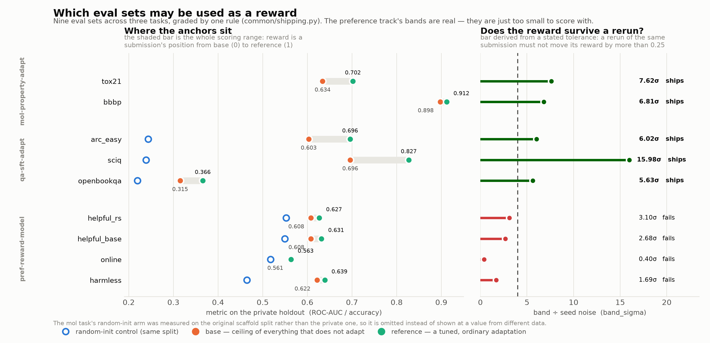

# Research

How the splits were cut and the anchors measured. Nothing here runs inside a task
container — it is the work that decides what a task's reward is allowed to be, and the
record of the measurements behind it.

| | |
|---|---|
| [`SPIKE_RESULTS.md`](SPIKE_RESULTS.md) | the original screen: Hydro (killed), protein (shelved here, later re-measured on-contract and found repairable), molecular property (shipped) |
| [`posttrain/RESULTS.md`](posttrain/RESULTS.md) | the two post-training tracks — screening, Gate A, anchor derivation, verifier costs |
| `posttrain/` | corpora, splits, effort ladders, GPU measurement and the anchor derivation |
| `results/` | measured anchors and ladders, as JSON, per track |
| `plot_criterion.py` | the figure below: every eval set against the shipping criterion |
| `plot_shortcut.py` | the length-shortcut finding and its repair |
| `plot_ladder.py` | the original mol/protein effort-ladder figure |



Both plotting scripts read the committed anchor and ladder JSON, so a figure cannot drift
from the measurement it claims to show.

## The pipeline

Measurement and decision are deliberately separate steps, so the rules can be re-read and
re-run without a GPU:

```
fetch_data.py     corpora, recorded with sha256 pins
pin_models.py     checkpoint revisions and file hashes
make_splits.py    the locked, length-balanced splits
modal_measure.py  one container per (arm, seed) on GPU -> records what every arm scored
finalize_anchors.py   turns that ladder into anchors by stated rules, and says
                      which eval sets may ship
assemble_tasks.py populates the task trees; refuses if an anchor is missing
verify_graders.py verifier regression suites against the real images
```

## Setup

```bash
cd research
uv venv --python 3.12 .venv
uv pip install --python .venv/bin/python pandas scipy numpy scikit-learn torch \
    transformers safetensors huggingface_hub rdkit datasets

.venv/bin/python fetch_flip2.py            # FLIP2 pins
.venv/bin/python moleculenet.py --help     # MoleculeNet downloads
.venv/bin/python posttrain/fetch_data.py   # hh-rlhf + multiple-choice QA, with sha256 pins
```

Third-party clones, the venv, embedding caches, large fixture checkpoints and the
regenerable corpora are gitignored. What ships — the agent's training file and the held-out
rows, anchors and fingerprints — is copied into each task tree by `assemble_tasks.py` and
is committed there.

`make_splits.py` needs `posttrain/PRIVATE_SEED`. The split is regenerable from the pins and
that seed, which is why `posttrain/split/` is not tracked.
