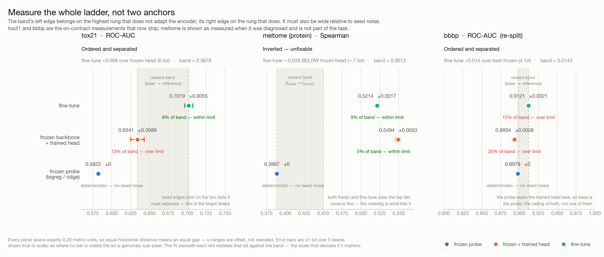

# `mol-property-adapt`

Encoder adaptation as an RL environment. The agent gets `DeepChem/ChemBERTa-77M-MLM` — a
3.4M-parameter RoBERTa over SMILES with no task head — labelled molecules for two
property-prediction tasks, and 4 hours on 8 CPUs with no GPU. It must produce the best
predictors it can for both.

**Status: active.** This is the task the rest of the repo is built from: its grader became
[`common/verifier_core.py`](../../common/verifier_core.py), shared by every other task.

## How it is scored

Mean ROC-AUC on a held-out **region of chemical space** — a contiguous neighbourhood of
structurally similar molecules removed whole, so the holdout is a real distribution shift
rather than a random sample.

```
recovery = clip((auc − base) / (reference − base), 0, 1)
reward   = integrity_gate × mean(recovery over the two eval sets)
```

## Anchors

Measured over 5 seeds on the private split
([`research/results/anchors_private.json`](../../research/results/anchors_private.json)):

| eval set | train | test | base | reference | band | separation |
|---|---|---|---|---|---|---|
| `tox21` (12 assays) | 2,000 | 1,566 | 0.6341 | 0.7019 | 0.0678 | **6.48σ** |
| `bbbp` (1 label) | 1,631 | 407 | 0.8978 | 0.9121 | 0.0143 | **4.09σ** |

`base` comes from a **different rung on each set** — a trained head on tox21 (0.6341,
beating a 0.5822 probe), a logistic probe on bbbp (0.8978, beating a 0.8934 head). That is
the point of "ceiling of the trivial class, not one member of it": taking the head on both
would have set bbbp's base 0.0044 low and paid every head-only submission ~31% of the
reward for free.



## Integrity

Three layers on disjoint inputs — architecture-config hash, sha256 against pinned public
checkpoints, per-tensor float64 cosine against the base encoder — plus **InChIKey
contamination**: the verifier computes the InChIKey of every molecule it can parse out of
what the agent submits, including `logs/agent/train_log.txt`, and rejects an eval set if a
held-out molecule appears. Matching on InChIKey rather than the SMILES string is
deliberate; the same molecule has many valid spellings.

The cosine layer deliberately **allows** an unmodified encoder. Freezing the backbone and
training only a head is legitimate; the anchors are what make it score zero.

## Run it

```bash
harbor run -c tasks/mol-property-adapt/configs/job-modal.json --agent oracle
./tasks/mol-property-adapt/scripts/regrade.sh --all
```

The oracle scored **reward 0.909661** through Harbor (`jobs/mol-oracle-modal/`) with 0
contamination overlap and 53 encoder tensors compared.

## Known issue

`tox21`'s oracle does not reproduce its own anchor: 0.6896 against `reference_auc = 0.7019`,
below the minimum of the five seeds that set it. `solution/train_reference.py` and the
anchor arm are the same recipe in two implementations, and the repo currently asserts both.
Either re-measure the anchor from the shipped script or drop the claim in its docstring —
tracked as open question 1 in the root [README](../../README.md#open-questions).

Split construction and anchor measurement live in [`research/`](../../research/SPIKE_RESULTS.md).
