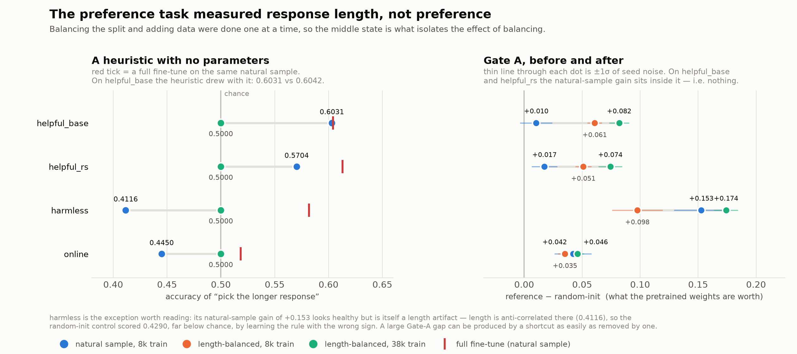

# `pref-reward-model`

Reward modelling — RLHF stage 2 — as an RL environment. The agent gets
`distilroberta-base`, 38,420 human preference pairs from hh-rlhf, one GPU and 4 hours. It
must post-train the encoder into something that reads a conversation and a candidate
response and returns a scalar, higher for the response a human preferred.

**Status: provisional — it does not pass the shipping criterion.** Its best eval set reaches
3.10σ against a bar of 4.0σ derived from a stated tolerance on reward noise
([`common/shipping.py`](../../common/shipping.py)). The environment is complete and every
integrity check passes; what fails is the *reward*, which would move by 0.32 on a rerun of
the same submission against a tolerance of 0.25. It is assembled only under
`assemble_tasks.py --allow-provisional` and the anchors carry `provisional: true`.

Use it as a worked example of a task that is built correctly and still is not usable. Do not
report scores from it as validated.

## How it is scored

One forward pass per response, no generation:

```python
text = f"{prompt}\n\nAssistant: {response}"
tok.truncation_side = "left"          # forced by the verifier
score = model(**enc).logits[:, 0]     # num_labels = 1
```

Left truncation is load-bearing: long conversations lose their beginning, never the
response being judged. Metric is **pairwise accuracy with ties counted as half** — the
only convention that leaves an uninformative model at exactly chance.

## The measured ladder

5 seeds per arm, ~3,960 held-out pairs per eval set, on the length-balanced split.

| arm | helpful_base | helpful_rs | online | harmless |
|---|---|---|---|---|
| `length_only` (pick the longer response) | 0.5000 | 0.5000 | 0.5000 | 0.5000 |
| `frozen_probe` (Bradley-Terry on frozen embeddings) | 0.6055 | 0.5976 | 0.5496 | 0.5696 |
| `frozen_head` (trained MLP on those embeddings) | 0.6082 ± 0.0056 | 0.6079 ± 0.0046 | 0.5610 ± 0.0042 | 0.6219 ± 0.0101 |
| `finetune` — **reference** | 0.6315 ± 0.0087 | 0.6268 ± 0.0061 | 0.5633 ± 0.0057 | 0.6390 ± 0.0064 |
| `random_init` | 0.5496 ± 0.0061 | 0.5525 ± 0.0102 | 0.5174 ± 0.0040 | 0.4649 ± 0.0102 |

No eval set passes. `helpful_rs` is the best at band 0.0189 and **3.10σ**, and it is the one
assembled provisionally — the other three are dropped for verifier wall time, not quality
(one eval set is ~966 s against test.sh's 3,000 s).

| eval set | band | band σ | reward noise on a rerun | verdict |
|---|---|---|---|---|
| `helpful_rs` | 0.0189 | 3.10σ | 0.32 | fails: imprecise |
| `helpful_base` | 0.0233 | 2.68σ | 0.37 | fails: imprecise |
| `harmless` | 0.0171 | 1.69σ | 0.59 | fails: imprecise |
| `online` | 0.0023 | 0.40σ | 2.48 | fails: imprecise, and not distinguishable from zero |

The distinction the criterion draws is worth reading: `helpful_rs`'s band **is** real
(z = 5.5, far above the Bonferroni-corrected bar), and it is still not usable as a reward.
An effect can exist and be too small to score with.

## Why the data is length-balanced




The first cut of this task measured **response length and nothing else**. On a natural
sample of hh-rlhf, "pick the longer response" — no model, no parameters — scored
**0.6031** against a full fine-tune's 0.6042 and a frozen-encoder ceiling of 0.5646. That
heuristic alone covered 97% of the reward band, and a randomly-initialized encoder reached
0.5938, inside the seed noise of the pretrained one.

The tell was `harmless`: every model arm scored *below chance* there, because they had
learned "longer is better" from a training file where it held (0.5356) and it is backwards
on that split (0.4116). They were length detectors with a sign error, not preference
models.

So the split — training file and every holdout — is length-balanced: equal counts of
longer-chosen and shorter-chosen pairs, ties dropped. `length_only` now reads exactly
0.5000 by construction and is a permanent rung of the ladder, so the heuristic can never
quietly become the ceiling again. Pretraining gain went from +0.010 to +0.07…+0.17.

Balancing is applied to the *training* file too. Leaving it biased would teach every
submission a feature worth nothing at grade time, which measures whether the agent spotted
a trap rather than whether it can post-train.

## Why it needs a GPU

Not a compute complaint — a consequence of the fix above. Length-balancing removed the
shortcut, and a model that has to judge content needs far more data: the frozen probe
alone moves 0.5778 → 0.6055 between 8,000 and 38,420 pairs. Two epochs over 38,420 pairs
is 6.7 hours on 8 CPU cores at the measured 2.85 pairs/s, so CPU-only would have meant
keeping the task at a scale where nothing separates the arms.

## Honest limits

- **It fails the bar.** 3.10σ against 4.0σ; a third of the reward band would be seed noise.
  For scale, `mol-property-adapt`'s `bbbp` passes at 4.09σ and a reward noise of 0.24.
- **It was the best of four screened eval sets.** Taking the maximum of four marginal
  measurements inflates it, which is why the existence test is Bonferroni-corrected by four.
- **An earlier, looser bar passed it.** The criterion used to be 3.0σ, chosen one notch below
  what the repo had already shipped, plus an absolute band floor that was removed after it
  excluded this eval set. Deriving the bar from a tolerance instead reversed the verdict.
- **The obstacle is real, not a tuning failure.** A trained head on frozen embeddings
  reaches 0.6082 where a full fine-tune reaches 0.6315. A 3-epoch reference was measured
  and *rejected* — it made things worse (0.6255 ± 0.0104).

## Run it

```bash
harbor run -c tasks/pref-reward-model/configs/job-modal.json --agent oracle
./tasks/pref-reward-model/scripts/regrade.sh --all
```

The oracle scored **reward 0.5828** through Harbor (`jobs/rm-oracle-modal/`). That is the
expected shape, not a defect: 0.6189 is −1.29σ on the reference arm's seed spread, and
`reference` is a five-seed *mean*, which a single seed lands under about half the time.

## An agent run — and the false reject it exposed

`codex` (gpt-5.6-sol), 49m 31s (`jobs/rm-codex-modal/`). It was graded **0.0** and should
have been graded **0.864497** (acc 0.6242, recovery 0.8645). The original result and the
regrade are both kept, in `verifier/` and `regrade/`.

```
encoder lineage check failed: min per-tensor cosine 0.8541 < 0.9
  on encoder.layer.0.attention.self.key.bias
```

The submission was an honest fine-tune of the provided base: **51 weight matrices at cosine
≥ 0.9999** (median 1.0000), with exactly **1 of 100** tensors under the floor — a
768-element attention key bias whose near-zero entries rotate a long way under a
functionally irrelevant update. The agent's own transcript: *"build a validation split by
prompt… fine-tuning experiments that exactly match the verifier's 256-token left-truncated
input format… full encoder fine-tuning is practical."*

Fixed in `common/verifier_core.py` — the cosine floor now applies to weight matrices only.
The bug was **intermittent**: the mol agent's 1-D minimum was 0.9998 and passed, while this
agent trained a fresh scalar head through a ranking loss on a GPU and moved that bias far.

It also did **not** write `train_log.txt`, despite rule 4 asking for one. So the
contamination scan saw only the model directory, not the log it deliberately scans first.

At 0.8645 the agent recovered 86% of a band that is itself too thin to ship — which does not
rescue the task. The reward still fails `common/shipping.py`.

Measurement and anchor derivation live in
[`research/posttrain/`](../../research/posttrain/RESULTS.md).
